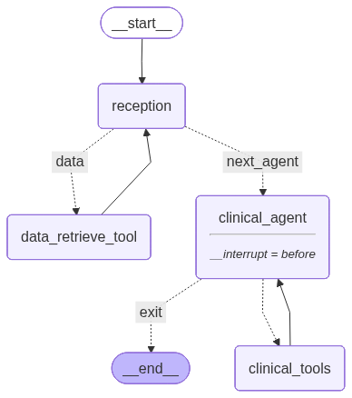

# Assignment : A Medical Assistant

## Architecture
- Framework used for making agents : Langgraph
- Below graph image shows much needed information.

- As can be seen from graph two nodes which are responsible for whole chatbot are reception node and clinical_agent node.
- These two are connected to tool node using conditional edges which runs and selects brach based on the function output.
